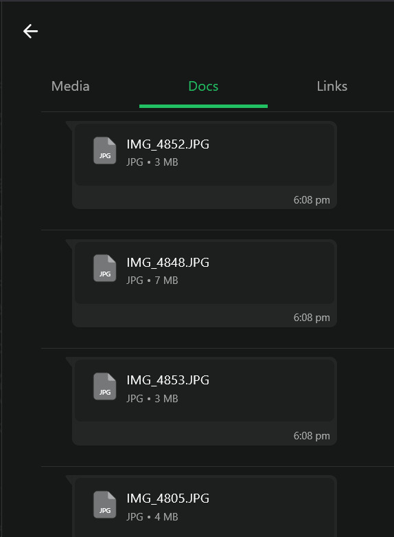
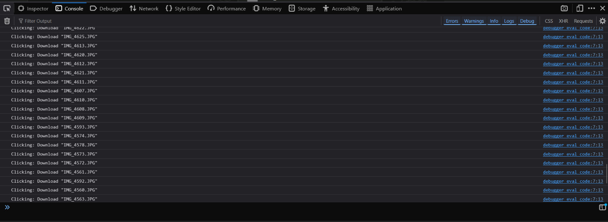

# 📥 WhatsApp Web Bulk File Downloader (Unofficial)

A small script to automate downloading multiple files (images, docs, videos, etc.) shared in a WhatsApp Web chat.

## 🔍 Problem

Downloading 100+ files manually from WhatsApp Web is boring and time-consuming. There’s no official "Download All" button.

## 💡 Solution

Using browser DevTools and a bit of JavaScript, this script clicks all the "Download" buttons with a delay to avoid overwhelming the browser.

## ⚙️ How It Works

1. Open WhatsApp Web.
2. Open the chat with the files.
3. Scroll through to load all the media/files you want.
4. Press `F12` or right-click > `Inspect` to open Developer Tools.
5. Go to the `Console` tab.
6. Paste the script from `script.js`.
7. Press `Enter`.

Your downloads will start one by one!

## 📜 Script

```js
const downloadButtons = Array.from(document.querySelectorAll('div[role="button"][title^="Download"]'));

console.log("Found", downloadButtons.length, "downloadable files");

downloadButtons.forEach((btn, i) => {
  setTimeout(() => {
    console.log("Clicking:", btn.title);
    btn.click();
  }, i * 1500); // 1.5s delay to avoid overwhelming
});
```

## 🧠 Learning Notes

* Inspected the DOM manually to locate the correct `div` elements.
* Faced issues like:

  * DOM elements not loading initially.
  * `Uncaught SyntaxError` when redeclaring variables.
  * Page hanging if too many downloads were triggered too quickly.
* Added delay (`setTimeout`) to reduce browser stress.

## 📸 Demo

<p align="center">
  
</p>

<p align="center">
  
</p>

## ⚠️ Disclaimer

This is for educational/personal use. Not affiliated with or endorsed by WhatsApp.

## 🏷️ Tags

`JavaScript`, `Web Automation`, `DevTools`, `Productivity`, `WhatsApp Web`, `Scripting`, `Life Hack`

---

